# Afiyet Olsun

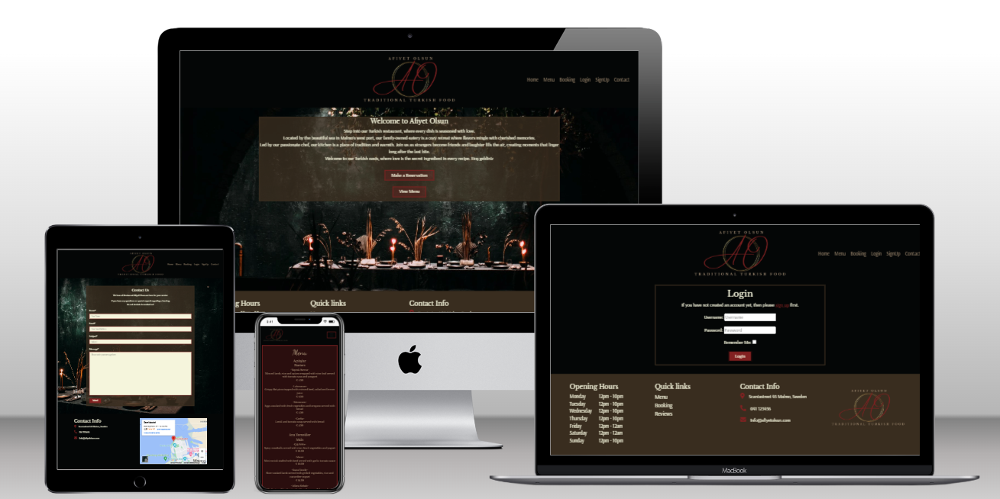

Afiyet Olsun is a family owned Turkish restaurant located in Malmo, Sweden that offers traditinal Turkish dishes in a cozy and warm environment. 
The webapplication for Afiyet Olsun allows users and future guests to make table reservations, view the restaurants menu and get in touch with the staff.
*Afiyet Olsun is a fictive restaurant*

[Visit Afiyet Olsun](https://afiyet-olsun-aa5b34b7e423.herokuapp.com/)

## Overview

## User Experience Design
### Strategy

### Scope

### Structure

### Skeleton

### Surface

## Agile

## Features
### Existing Features

#### Navigation Menu

**Default nav menu**

* Visible for all visitors on the website
* Contains links to
  * Home
  * Menu
  * Booking
  * Login
  * Signup
  * Contact

**User nav menu**

* Visible for users who have an regular account
* Contains links to
  * Home
  * Menu
  * Booking (Booking Form)
  * Reservations
  * Logout
  * Contact

**Staff nav menu**

* Vivible for staff members
* Contains links to
  * Home
  * Menu
  * Booking (Booking Form)
  * Reservations
  * Inbox
  * Reviews
  * Logout

#### Home Page

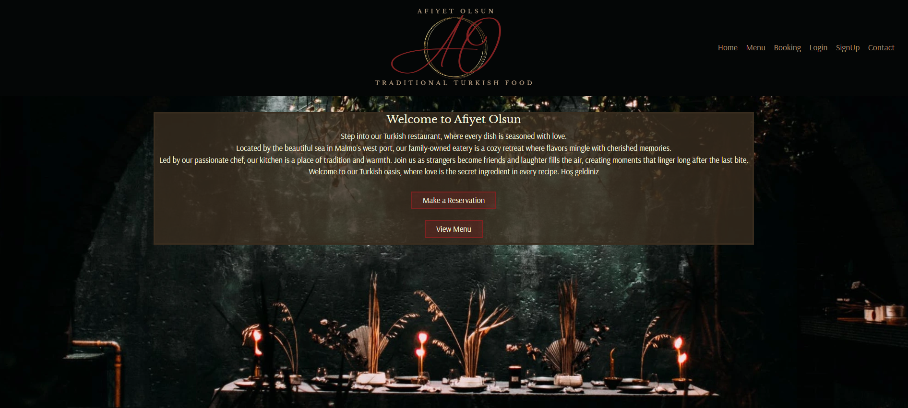

The homepage contains a **Welcome Text* for the user with a short description about the restaurant with butoons to take the user to **Make a Reservation* or **View the Menu*

#### Footer

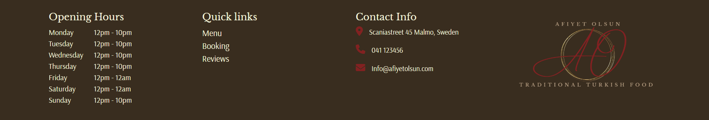

The footer contains **Opening Hours* **Quick Links* **Contact Info* and **Afiyet Olsun's Logo*.

* Afiyet Olsun Logo
  * Is clickable and redirect the user to the Home Page

* Quick Links 
  * Menu
  * Booking
  * Reviews

**Quick Links for user with regular account**

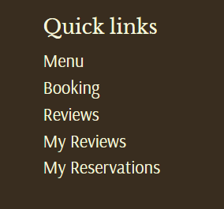

For a user with a regular account links to **My Reviews* and **My Reservation* is visible.

* Future Features

## Technologies Used
* HTML
  * Website structure was developed using HTML as the main language
* CSS
  * Custom CSS in an external file to style the website
* Python 
  * Python was the main programming language for application using The Django Framework
* GitPod
  * Gitpod IDE was used to develope the website
* GitHub
  * Githud is used to host source code
* Git
  * Used to commit and push code from GitPod to GitHub during development of the website
* Canva
  * Was used to design logotype, favicon & ERD's
* Balsamiq
  * Was used to create wireframes
* Favicon.io
  * Was used to create favicon
* RapidTables
  * Was used to convert HEX colors to RGB
* Pixelied
  * Used to convert png to webp
* Font Awesome
  * Used to implement icons
* Google Fonts
  * Used to add fonts

**External Python Modules**
* asgiref==3.7.2
* crispy-bootstrap5==0.7
* dj-database-url==0.5.0
* Django==4.2.10
* django-allauth==0.57.2
* django-crispy-forms==2.1
* gunicorn==20.1.0
* oauthlib==3.2.2
* psycopg2==2.9.9
* PyJWT==2.8.0
* python3-openid==3.2.0
* requests-oauthlib==1.3.1
* shortuuid==1.0.11
* sqlparse==0.4.4
* whitenoise==5.3.0

## Testing

### Code Validation

#### HTML Validator
##### W3C HTML Validator

All code were validated through W3C Validation Service by direct input. Direct input were used due to limitation to access pages.

* Errors regarding some stray closing div tags occoured but was removed.
* Warnings and errors due to the use of Django template snippets.

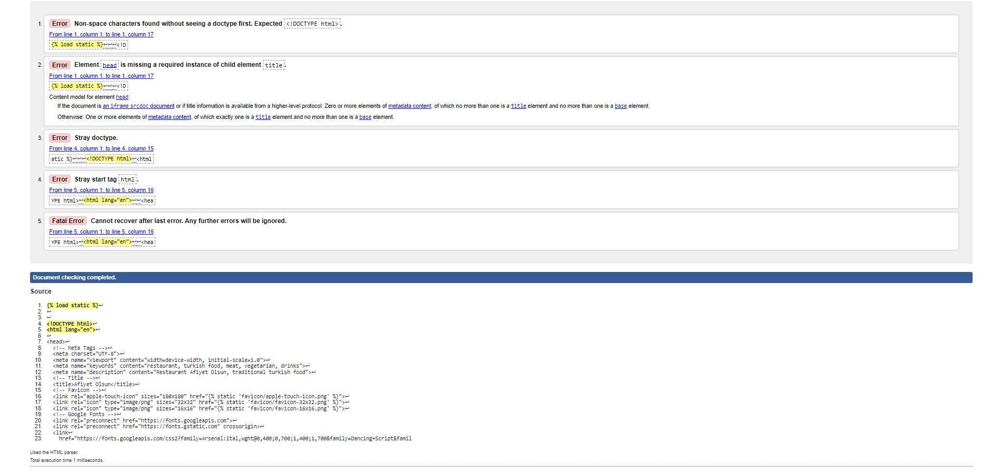

#### CSS Validator
##### W3C CSS Validation

CSS code were validated through W3C CSS Validation Service by direct input.
* No errors were found in the CSS file.

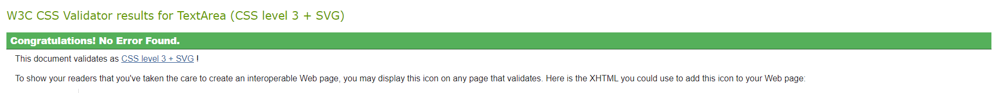

When validating css by URI several errors and warnings occoured, this is identifyed to Bootstrap which is used in Afiyet Olsun Project.

#### Python Validation
##### PEP8 CI Python Linter

All python file's were validated through CI Python Linter.

* Errors trown due to long lines or whitespaces.
  * Fixed and no errors are shown 

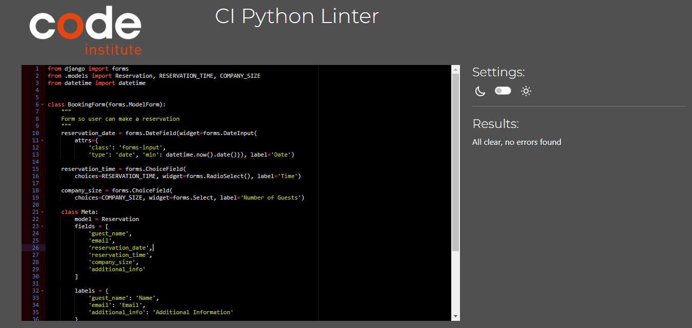

### Feature Testing

#### Navigation
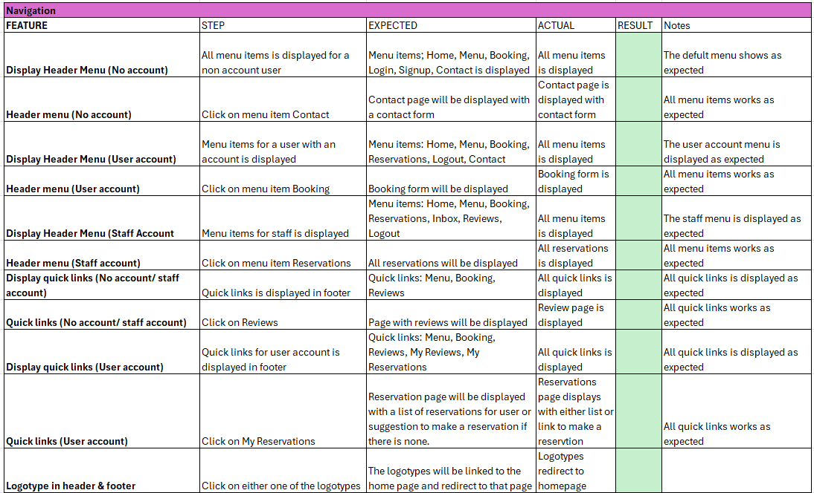

#### Account Testing
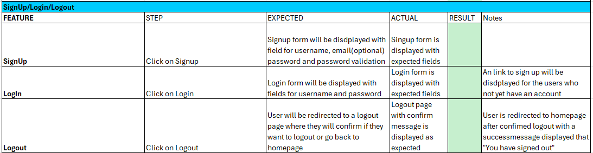

#### Contact Testing
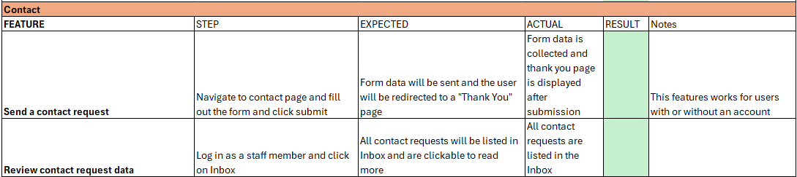

#### Booking Testing
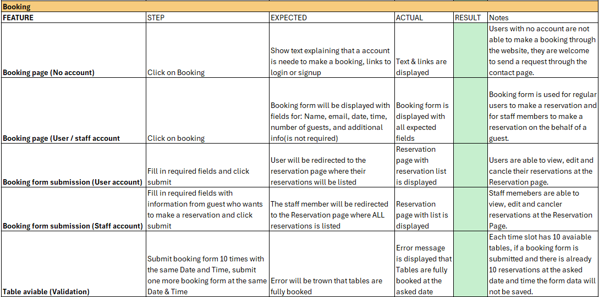

#### Reservations Testing
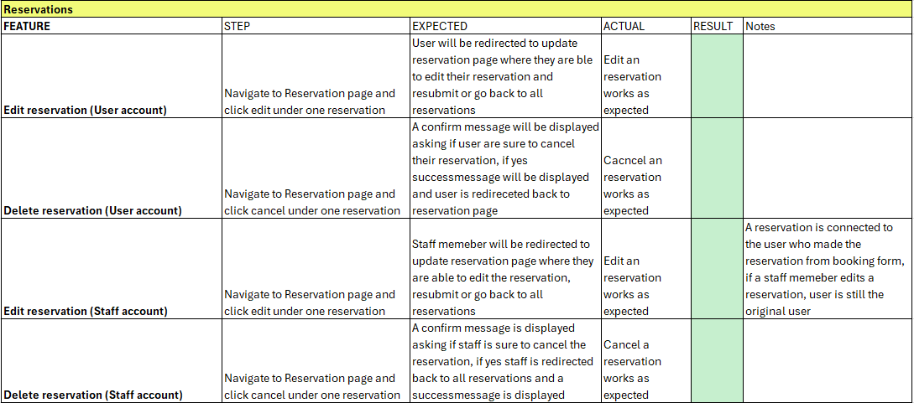

#### Review Testing
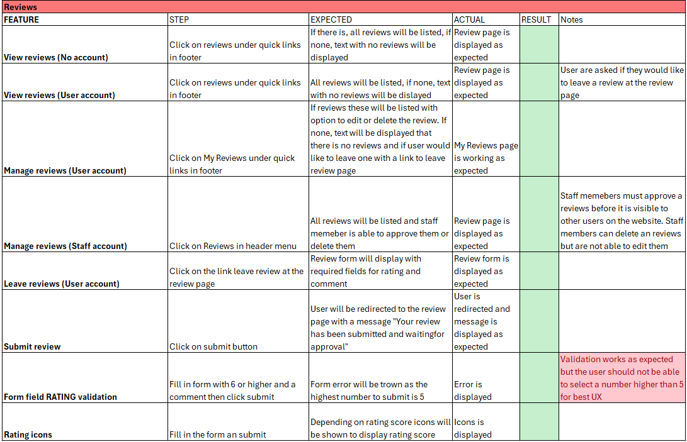

## Deployment

## Credits

## Acknowledgements

