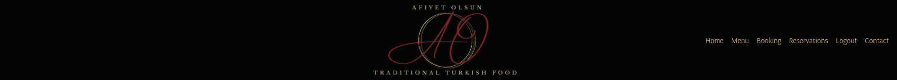
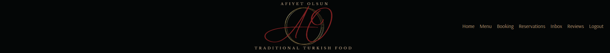

# Afiyet Olsun

Afiyet Olsun is a family owned Turkish restaurant located in Malmo, Sweden that offers traditinal Turkish dishes in a cozy and warm environment. 
The webapplication for Afiyet Olsun allows users and future guests to make table reservations, view the restaurants menu and get in touch with the staff.
*Afiyet Olsun is a fictive restaurant*

[Visit Afiyet Olsun](https://afiyet-olsun-aa5b34b7e423.herokuapp.com/)

## Overview

## UX

The goal with the website **Afiyet Olsun** is to create a user-friendly and efficient platform for both users and staff to manage reservations with full CRUD capabilities.
Additional features will be the ability to view and leave reviews, peruse the restaurants menu and easily contact the restaurant. 

## Agile Methodology

Agile was used for efficient planning and development of the website, ensuring alignment with UX requirements.

9 Milestones was created where each had EPIC's related to them and every EPIC had tasks that needed to be completed. 
These tasks was divided into 3 topics **USER STORY**, **USER STORY Admin** and **Development**

### Milestone 1 - Design & Prototype
#### EPIC 1 - Create user-centric design and prototype
##### Tasks/Stories
* Development: Logotype
  * As a developer I need to design a logotype for brand recognition.
* Development: Color scheme
  * As a developer I need to decide for a color scheme for branding and consistency.
* Development: Wireframes
  * As a developer I need to create wireframes so that I have a plan and guidlines how to build the websites structure.
* Development: Favicon
  * As a developer I need to create a favicon similar to the logotype to increase user experience.

### Milestone 2 - Database & Integration
#### EPIC 2 - Database schema & system integration
##### Tasks/Stories
* Development: Implement database management system
  * As a developer I need to implement DBMS into my project to offer database-dependent features.
* Development: Set up database
  * As a developer I need to set up DBMS to store and manage data for webb application.
* Development: Entity-Relationship Diagrams
  * As a developer I need to create ERD's for my database to define requirements.

### Milestone 3 - Base setup
#### EPIC 3 - Frontend & backend development
##### Tasks/Stories
* Development: Create new application
  * As a developer I must create a new repo and install necessary dependencies so that I can start to build the new web application.
* Development: First deployment
  * As a developer I must make an early deploy to heroku so that I can test my application during the development stage.
* Development: Backend
  * As a developer I must develope backend functionallity for the web application to handle user authentication & data management.
* Development: Frontend
  * As a developer I must implement user interface (UI) components based on wireframes to increase the user experience of the web application.
* USER STORY: Contact information 
  * As a site user I can view contact information so that I can reach out to the restaurant.
* USER STORY: View menu
  * As a site user I can view the restaurants menu so that I can see in advance that the food/drinks they offering is suitable.

### Milestone 4 - User authentication
#### EPIC 4 - User account management
##### Tasks/Stories
* Development: Allauth
  * As a developer I must implement allauth so that the users can register for an account and use the web applications features.
* USER STORY: Account registration 
  * As a site user I can register an account so that I can manage my reservations and reviews.
* USER STORY: Login / Logout
  * As a site user I can login and logout from my account so that I can manage my bookings/rewievs and then logout when I am done.

### Milestone 5 - Booking system
#### EPIC 5 - Reservation management
##### Tasks/Stories
* Development: Reservation feature
  * As a developer I must develope a booking feature so the user / staff can manage bookings/reservations.
* USER STORY Admin: View reservations
  * As a site admin I can view reservations so that I can manage them.
* USER STORY Admin: Edit reservations
  * As a site admin I can edit a guests reservation to accommodate changes as requested by the guest or changes that need to be made to restaurant seating.
* USER STORY Admin: Cancel reservations
  * As a site admin I can cancel a reservation so that the guest and the restaurant know the reservation is no longer valid.
* USER STORY Admin: Make reservation for guest
  * As a site admin I can make a table reservation on behalf of an guest so that the guest can be guaranted seating on their desired date and time.
* USER STORY: Book reservation
  * As a site user I can book a table reservation so that I can be guaranted seating on my desired date and time.
* USER STORY: Edit reservation
  * As a site user I can edit my table reservation so that I can change date, time or company size.
* USER STORY: Cancel reservation
  * As a site user I can cancel my table reservation so that I can notify the restaurant that the reservation is no longer needed due to changed plans
* USER STORY: Send special request
  * As a site user I can send a special request so that I can ask the restaurant if they can fullfill my request.

### Milestone 6 - Reviews & Rating system
#### EPIC 6 - Review management
##### Tasks/Stories
* Development: Review & rating feature 
  * As a developer I must develope a review and rating feature so the users can leave & read reviews.
* USER STORY Admin: Manage reviews
  * As a site admin I can view site users rewievs so that I can approve them or delete them.
* USER STORY: View reviews
  * As a site user I can see reviews from previous guests so that I can read about the dining experience and form an opinion about the restaurant.
* USER STORY: Leave reviews 
  * As a site user I can leave reviews so that I can share my dining experience.
* USER STORY: Edit rewievs
  * As a site user I can edit my rewievs so that I can change my opinion or correct a typo.
* USER STORY: Delete rewievs 
  * As a site user I can delete my rewievs so that I can remove outdated and inaccurate feedback.

### Milestone 7 - Testing
#### EPIC 7 - Testing & Validation
##### Tasks/Stories
* Development: Feature testing
  * As a developer I must test each feature so that the web application works with no issue.
* Development: Code validation
  * As a developer I must test the code thorugh validation tools to ensure it meets the coding standards.
* Development: Performence and responsiveness testing
  * As a developer I must test the responsiveness and perfomence of the web application to ensure optimal user experience.

### Milestone 8 - Deployment final Heroku
#### EPIC 8 - Heroku deployment
##### Tasks/Stories
* Development: Final deployment
  * As a developer I must make one final deployment to heroku so my users can access the live site.

### Milestone 9 - Deocumentation
#### EPIC 9 - Project Documentation
##### Tasks/Stories
* Development: Readme 
  * As a developer I must write a clear and descriptive readme about the project.

More information related to the different topics can be seen under each card at the projects kanban board.
[Project **Afiyet Olsun** Kanban Board](https://github.com/users/SaraTisell/projects/5)

## Entity-Relationship Diagram

ERD's was made to design the database and the relation between the tables.

ERD Planning stage

ERD Final

## Features
### Existing Features

#### Navigation Menu

**Default nav menu**

* Visible for all visitors on the website
* Contains links to
  * Home
  * Menu
  * Booking
  * Login
  * Signup
  * Contact

**User nav menu**

* Visible for users who have an regular account
* Contains links to
  * Home
  * Menu
  * Booking (Booking Form)
  * Reservations
  * Logout
  * Contact

**Staff nav menu**

* Vivible for staff members
* Contains links to
  * Home
  * Menu
  * Booking (Booking Form)
  * Reservations
  * Inbox
  * Reviews
  * Logout

#### Home Page

The homepage contains a **Welcome Text* for the user with a short description about the restaurant with butoons to take the user to *Make a Reservation* or *View the Menu*

#### Footer

The footer contains *Opening Hours* *Quick Links* *Contact Info* and *Afiyet Olsun's Logo*.

* Afiyet Olsun Logo
  * Is clickable and redirect the user to the Home Page

* Quick Links 
  * Menu
  * Booking
  * Reviews

**Quick Links for user with regular account**

For a user with a regular account links to *My Reviews* and *My Reservation* is visible.

#### Signup, Login, Logout

**SignUp**

User are able to create an account by navigate to *Signup* and fill in fields for:
* Username
* Email (Optional)
* Password
* Password Validation

**Login**

Users are able to login with:
* Username
* Password

Message that the user has logged in

**Logout**

A user can logout by click on *Logout* in nav menu and, they are redirected to a logout page where they can confirm logout or go back to Home Page.
If they confirm logout, they are redirected to Home Page with a message.

#### Booking

A user must have an account to be able to make a Resrvation at the website

**Booking page for user with no account**

When a user that is not logged in navigates to the *Booking Page* they are asked to Login or Signup.
  * Links to *Login* & *Signup* 

Info text with benefits for having an account at Afiyet Olsun is displayed.

**Booking page for user / staff with account**

A user or staff member can make a reservtion by fill in the form with valid information.

The fields:
* Name
* Email
* Date 
* Time
* Number of guests
* Additional info (optional)
* Submit button

A staff member is able to make a reservation on the behalf of a guest that does not have an account at Afiyet Olsun.
When a valid booking form has been submitted, the user/staff is redirected to the *Reservations* page with a confirm message of the reservation.

#### Reservations

Reservations page is only visible for user with account and staff

**User with account**

**No Reservations**
If a user does not have any reservations they are asked if they would like to make a reservation and a button with link to the booking form is displayed.

**Existing Reservations**
If a user has reservations these will be displayed as a list at the *Reservation* page.
The user is able to edit their reservation or cancel their reservation by click one of the links under the reservation.

**Staff members**

A staff member can see all exisiting reservations by navigate to the *Reservations* page.
Staff is able to edit or cancel any reservation by click one of the links under the reservation.

**Edit Reservation**

If a user or a staff member want to edit an reservation they are redirected to the update reservation page where they can change infromation in desired field and resubmit the form.

A success message that the reservation has been updated will be displayed and the user/staff is redirected back to the *Reservations* page.

If a user or staff member want to cancel an reservation they are redirected to a delete page where they have to confirm the cancelation of the reservation.

When a reservation is canceled the user/staff is redirected to the *Reservations* page and a success message is displayed.

#### Contact

Any user that visits the website is able to send a Contact Request through the contact from at the *Contact* page. 

**View Contact Requests**

Staff members are able to view all contact requests at the *Inbox* page. The name and subject of the contact request form is visible and the staff member can click on *Read more* to see email and message.

#### Reviews

Users with account are able to leave reviews with a rating score and a comment.

*Rating score is 1 -5 and are displayed with icons*
🥙/🫓
*For each score one filled flatbread* "🥙" *is increased.*
 *Example:*
 *ratings score 3/5 will be displayed as* "🥙🥙🥙🫓🫓"

**Review page for user with no account**
If the website has no reviews and a user is not logged in :

If the website has reviews:

**Review page for user with account**

If the user is logged in and the website does not have any reviews they are asked to leave one with a link displayed.

**Leave review user**

A user can leave a review by click the leave review link at the *Reviews* page and they are redirected to a form to fill in rating and comment and submit. After the user have leaved a reveiew they are redirected back to the *Reviews* page and a message is displayed.

A user can views their reviews by navigate and click the link *My Reviews* unser the Quick Links in the footer.
The user is able to edit or delete their review.

**If the user does not have any reviews and navigates to *My Reviews* page**

**Manage reviews staff**

Staff can manage reviews by navigate and click on *Reviews* in the header nav menu. The staff is able to approve or delete the review.

#### Food Menu

any user that visits the website is able to view the food *Menu* where dishes and prices is displayed.

## Design

### Logotype

## Technologies Used
* HTML
  * Website structure was developed using HTML as the main language
* CSS
  * Custom CSS in an external file to style the website
* Python 
  * Python was the main programming language for application using The Django Framework
* GitPod
  * Gitpod IDE was used to develope the website
* GitHub
  * Githud is used to host source code
* Git
  * Used to commit and push code from GitPod to GitHub during development of the website
* Canva
  * Was used to design logotype, favicon & ERD's
* Balsamiq
  * Was used to create wireframes
* Favicon.io
  * Was used to create favicon
* RapidTables
  * Was used to convert HEX colors to RGB
* Pixelied
  * Used to convert png to webp
* Font Awesome
  * Used to implement icons
* Google Fonts
  * Used to add fonts

**External Python Modules**
* asgiref==3.7.2
* crispy-bootstrap5==0.7
* dj-database-url==0.5.0
* Django==4.2.10
* django-allauth==0.57.2
* django-crispy-forms==2.1
* gunicorn==20.1.0
* oauthlib==3.2.2
* psycopg2==2.9.9
* PyJWT==2.8.0
* python3-openid==3.2.0
* requests-oauthlib==1.3.1
* shortuuid==1.0.11
* sqlparse==0.4.4
* whitenoise==5.3.0

## Testing

### Code Validation

#### HTML Validator
##### W3C HTML Validator

All code were validated through W3C Validation Service by direct input. Direct input were used due to limitation to access pages.

* Errors regarding some stray closing div tags occoured but was removed.
* Warnings and errors due to the use of Django template snippets.

#### CSS Validator
##### W3C CSS Validation

CSS code were validated through W3C CSS Validation Service by direct input.
* No errors were found in the CSS file.

When validating css by URI several errors and warnings occoured, this is identifyed to Bootstrap which is used in Afiyet Olsun Project.

#### Python Validation
##### PEP8 CI Python Linter

All python file's were validated through CI Python Linter.

* Errors trown due to long lines or whitespaces.
  * Fixed and no errors are shown 

### Feature Testing

#### Navigation

#### Account Testing

#### Contact Testing

#### Booking Testing

#### Reservations Testing

#### Review Testing

## Deployment

## Credits

## Acknowledgements

